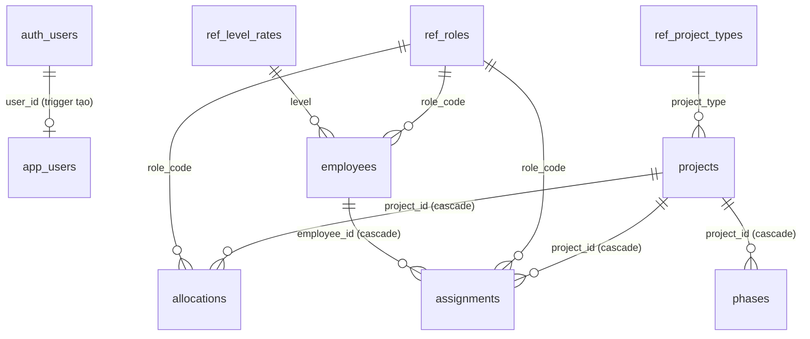

# DATABASE — Tài liệu mô tả Cơ sở dữ liệu
## Resource Planner (ideaLAB)

> **Nguồn sự thật:** `db/schema.sql` (bảng, constraint, RLS, trigger) + `db/views.sql` (toàn bộ tính toán) + `db/seed.sql` (dữ liệu mẫu). Tài liệu này **mô tả** chúng — khi sửa SQL nhớ cập nhật file này.
>
> **Nền tảng:** Supabase (PostgreSQL 16) · ref `nnqpanuezemrqyznkffy` (ap-southeast-1) · **Phiên bản:** 1.0 · **Ngày:** 14/06/2026.

---

## 1. Triết lý thiết kế (4 nguyên tắc DB)

1. **Mọi tính toán nằm ở SQL VIEW** (D8) — demand, capacity, cost, margin, slack, vòng học… đều là view. Client/AI không tính tiền → **0 token vận hành**, một nguồn công thức duy nhất.
2. **Đọc qua VIEW, ghi qua BASE TABLE.** Client (authenticated) **không SELECT cột nhạy cảm trực tiếp**; đọc đi qua view (view do `postgres` sở hữu → bypass RLS base table, nhưng tự lọc bảo mật bên trong).
3. **RBAC ở tầng database** (D19). Số tiền (rate, cost, margin, revenue) **chặn bằng `is_finance()`** trong view + guard trigger — không chỉ ẩn UI. An toàn dù anon key nhúng ở client.
4. **Constraint = lưới an toàn cho dữ liệu/AI.** FK, CHECK, UNIQUE chặn dữ liệu vô lý ngay ở DB (percent 0–100, headcount ≤ 50, month = ngày 01, end ≥ start…).

> Thứ tự chạy SQL: **`schema.sql` → `views.sql` → `seed.sql`**.

---

## 2. Sơ đồ quan hệ (ERD)



**Quan hệ dạng văn bản:**
- `app_users.user_id` → `auth.users.id` (Supabase Auth) — *tạo tự động qua trigger khi đăng ký*.
- `employees.role_code` → `ref_roles.code`; `employees.level` → `ref_level_rates.level`.
- `projects.project_type` → `ref_project_types.code`.
- `phases / allocations / assignments .project_id` → `projects.id` (**ON DELETE CASCADE** — xóa dự án xóa hết con).
- `allocations / assignments .role_code` → `ref_roles.code`.
- `assignments.employee_id` → `employees.id` (**CASCADE**).
- ⚠ **Không** có FK ràng `allocations` ↔ `phases` — là 2 bảng độc lập (cố ý, B2/B3 hoãn đồng bộ phase↔allocation ở tầng dữ liệu; ràng buộc "trong phase" chỉ ở UI).

---

## 3. Data Dictionary — Bảng nghiệp vụ

> 🔒 = **cột nhạy cảm** (tài chính, chỉ `finance` đọc qua view).

### 3.1 `projects` — Dự án
| Cột | Kiểu | Ràng buộc / Mặc định | Ghi chú |
|---|---|---|---|
| id | uuid | PK, `gen_random_uuid()` | |
| name | text | NOT NULL | Tên dự án |
| description | text | | |
| project_type | text | FK → `ref_project_types.code` | BI_DASHBOARD, DATA_PLATFORM… |
| pm_owner | text | NOT NULL | Tên PM |
| priority | int | 1–5, default 3 | P1..P5 |
| status | text | default `active`, in (draft/active/closed/cancelled) | Đóng dự án → `closed` |
| start_month | date | NOT NULL, ngày = 01 | Đầu khung |
| end_month | date | NOT NULL, ngày = 01, ≥ start | |
| 🔒 revenue | numeric | default 0 | Giá trị hợp đồng (triệu) |
| 🔒 other_cost | numeric | default 0 | Chi phí khác ngoài lương (triệu) |
| 🔒 mgmt_pct | numeric | default 0 | % management overhead (D16) |
| roles | text[] | default `{}` | Role tham gia (tường minh, D6) |
| created_by | text | NOT NULL | |
| playbook_version, model_version | text | | Cho vòng AI (Phase 5) |
| created_at | timestamptz | now() | |
| closed_at | timestamptz | | Set khi đóng |
| close_note | text | | Bài học khi đóng (vòng học) |

### 3.2 `phases` — Roadmap (giai đoạn)
| Cột | Kiểu | Ràng buộc | Ghi chú |
|---|---|---|---|
| id | uuid | PK | |
| project_id | uuid | FK → projects, CASCADE | |
| name | text | NOT NULL | |
| start_month, end_month | date | end ≥ start | |
| sort_order | int | default 1 | Thứ tự hiển thị |

### 3.3 `allocations` — Nhu cầu role × tháng (lớp kế hoạch cơ bản, D3)
| Cột | Kiểu | Ràng buộc | Ghi chú |
|---|---|---|---|
| id | uuid | PK | |
| project_id | uuid | FK → projects, CASCADE | |
| role_code | text | FK → ref_roles | |
| month | date | ngày = 01 | |
| headcount | numeric | **0 ≤ x ≤ 50** | Số người role này cần trong tháng |
| kind | text | default `estimate`, in (estimate/actual) | `actual` ghi khi **đóng dự án** |
| | | **UNIQUE (project_id, role_code, month, kind)** | |

### 3.4 `assignments` — Gán người cụ thể (lớp phủ OPTIONAL, D3)
| Cột | Kiểu | Ràng buộc | Ghi chú |
|---|---|---|---|
| id | uuid | PK | |
| project_id | uuid | FK → projects, CASCADE | |
| role_code | text | FK → ref_roles | |
| month | date | ngày = 01 | |
| employee_id | uuid | FK → employees, CASCADE | |
| percent | numeric | **0 < x ≤ 100** | % effort người này (KHÔNG phải tiền) |
| | | **UNIQUE (project_id, role_code, month, employee_id)** | |

### 3.5 `employees` — Nhân sự (rate theo CÁ NHÂN, D4)
| Cột | Kiểu | Ràng buộc | Ghi chú |
|---|---|---|---|
| id | uuid | PK | |
| name | text | NOT NULL | |
| role_code | text | FK → ref_roles | Role chính (PIC) |
| level | text | FK → ref_level_rates | Intern..Lead |
| rate_type | text | default `monthly`, in (monthly/hourly) | |
| 🔒 rate | numeric | default 0 | monthly: triệu/tháng · hourly: nghìn/giờ |
| active | boolean | default true | Nghỉ → false (giữ lịch sử) |

> **⏭ ĐÃ CHỐT THIẾT KẾ, CHƯA BUILD (15/06/2026 — D22–D24).** Schema/views hiện tại GIỮ NGUYÊN cho tới đợt build kế tiếp. Hướng đã chốt:
> - **D22 — lớp burn-actual:** thêm field **giờ effort thực / người / tháng** ở **tầng `assignments`** (đo hiệu quả burn). KHÔNG dùng `allocations.kind='actual'` (đó là snapshot role lúc đóng — t5). `assignments.percent` hiện = kế hoạch; burn-actual là field/lớp riêng, nullable, không ghi đè plan.
> - **D23 — cost vs load:** `v_employee_load` (load) cho vượt 100%; còn `v_emp_cost`/`v_project_cost` cho người **fixed (monthly)** dùng **mẫu số 160 cố định, có trần = lương thật** (`cost_j = rate × giờ_j ÷ 160`, độc lập từng dự án) — vênh idle/overload đưa về **view mức công ty**, KHÔNG bịa chi phí. Hourly giữ `giờ × rate`.
> - **D24 — rate theo thời gian:** `employees.rate` (một ô) → **lịch sử rate effective-dated** `(employee_id, rate_type, rate, hiệu_lực_từ)`, mốc theo tháng (D2). `v_emp_cost` join rate theo tháng; lớp actual **freeze** rate lúc log.

---

## 4. Data Dictionary — Bảng tham chiếu (catalog) & hệ thống

| Bảng | Cột chính | Vai trò |
|---|---|---|
| `ref_roles` | code (PK), name, declared_capacity, sort_order, **is_management**, **is_primary** | Danh mục role; `declared_capacity` = năng lực **khai báo** (fallback khi chưa có người thật). `is_management`=role tính qua management% (overhead, không allocate trực tiếp — D5); `is_primary`=role chính của dự án data (ưu tiên hiển thị + default what-if/lưu nhanh). **Web nạp 2 cờ này thay cho hardcode `MGMT_ROLES`/`PRIMARY_ROLES` — NFR-09** |
| `ref_level_rates` | level (PK), 🔒 monthly_rate | Rate gợi ý theo level (nhạy cảm) |
| `ref_project_types` | code (PK), name | Loại dự án (FK của projects) |
| `ref_norms` | key (PK), value, description | Hệ số chuẩn cho ước lượng (vòng học) |
| `app_users` | user_id (PK→auth.users), email, role (pm/finance) | **RBAC** — phân quyền theo user |
| `app_llm_configs` | id, label, provider, model, is_active | Cấu hình AI model (Phase 5) |
| `audit_log` | id, actor, action, entity, detail jsonb, at | Nhật ký hành động |

---

## 5. Views — nơi chứa TOÀN BỘ tính toán

> View do `postgres` sở hữu → bypass RLS base table. Bảo mật: (a) view **public** không select cột tiền; (b) view **finance** có `where is_finance()` → PM gọi trả **0 dòng**.

### 5.1 Helpers nội bộ
| View | Công thức | Dùng cho |
|---|---|---|
| `v_emp_cost` | hourly → `rate×160/1000` triệu/tháng; monthly → `rate` | quy đổi chi phí 1 người |
| `v_role_avg_cost` | avg chi phí người active của role; fallback rate level `Middle` | ước lượng slot **chưa gán người** |
| `v_role_capacity` | số người **active** của role; fallback `declared_capacity` (D3/D15) | năng lực |

### 5.2 PUBLIC views (mọi user — KHÔNG tiền)
| View | Ý nghĩa | Logic chính |
|---|---|---|
| `v_projects_public` | Dự án (bỏ cột tiền) | projects trừ revenue/other_cost/mgmt_pct |
| `v_employees_public` | Nhân sự (bỏ rate) | employees trừ rate/rate_type |
| `v_monthly_demand` | Σ nhu cầu role×tháng | allocations kind=estimate, **project active**, group role×month |
| `v_capacity_gap` | Năng lực − nhu cầu | capacity − demand theo role×tháng |
| `v_conflict` | Tháng/role thiếu người | gap < 0 + danh sách dự án gây thiếu |
| `v_employee_load` | Tải cá nhân/tháng | Σ percent theo employee×month (>100 = quá tải) |
| `v_slack` | Dư địa | gap > 0 theo role×tháng |
| `v_estimate_vs_actual` | Vòng học (dự án closed) | join est↔act theo project/role/month → ratio |
| `v_norm_suggestions` | Hệ số lệch TB | avg(ratio) theo project_type×role |

### 5.3 FINANCE views (chặn `is_finance()` — PM → 0 dòng)
| View | Ý nghĩa | Công thức |
|---|---|---|
| `v_level_rates` | Rate theo level | `where is_finance()` |
| `v_employee_cost` | Chi phí từng người (kèm rate) | + monthly_cost quy đổi |
| `v_projects_finance` | Dự án kèm cột tiền | revenue/other_cost/mgmt_pct |
| `v_project_cost` | **Chi phí NS dự án** | Σ qua role×tháng: `chi phí người đã gán (% × rate cá nhân) + (need − fte đã gán) × avg_cost role`. *Ưu tiên người gán, fallback rate TB role.* |
| `v_project_margin` | **Margin** | `revenue − (project_cost + other_cost + (project_cost+other_cost)×mgmt_pct/100)` (D5/D16) |

> **Margin là thước đo lời/lỗ duy nhất** (D4/D5). `total_cost = NS + khác + management%`.

---

## 6. Mô hình bảo mật (RBAC)

### 6.1 Hàm `is_finance()` *(security definer, stable)*
```sql
auth.uid() IS NULL            -- ngữ cảnh service_role / SQL Editor (seed) → full quyền
  OR exists(app_users where user_id=auth.uid() and role='finance')
```
- `pm` → false → view tiền trả 0 dòng.
- `finance` (CEO/BOD/Admin) → true → thấy tất cả.

### 6.2 Trigger
| Trigger | Trên bảng | Tác dụng |
|---|---|---|
| `on_auth_user_created` → `handle_new_user()` | `auth.users` (sau INSERT) | User mới đăng ký → tự tạo dòng `app_users` role **`pm`** (an toàn: chưa thấy tiền) |
| `trg_guard_project_fin` → `guard_project_financials()` | `projects` (before INSERT/UPDATE) | Non-finance: INSERT ép `revenue/other_cost/mgmt_pct = 0`; UPDATE giữ giá trị cũ → **PM không gài được số tiền** |

### 6.3 GRANT & RLS Policy (tóm tắt)
- `revoke all ... from anon, authenticated` rồi cấp lại có chọn lọc. **anon (chưa login) = không có gì** → buộc đăng nhập.
- **Catalog** (`ref_roles`, `ref_project_types`, `ref_norms`): authenticated **đọc** (policy `using(true)`); **ghi** chỉ `is_finance()`. *(GRANT insert/update/delete phải có thì policy mới hiệu lực — bài học bug đã sửa.)*
- **`ref_level_rates`, `employees`**: chỉ `is_finance()` (đọc rate đi qua view).
- **`projects`**: authenticated đọc/ghi (`using(true)`) — guard trigger chặn cột tiền của PM; đọc tiền đi qua `v_projects_finance`.
- **`phases / allocations / assignments`**: authenticated (pm & finance) **toàn quyền** (`using(true)`) — đây là lớp effort, không nhạy cảm.
- **`app_users`**: đọc dòng của mình hoặc finance đọc tất cả; **ghi chỉ finance** (`au_fin_write`) → PM **không tự nâng quyền**.
- **`audit_log`**: authenticated ghi; chỉ finance đọc.
- View finance vẫn `grant select ... to authenticated` nhưng **tự lọc `is_finance()` bên trong**.

### 6.4 Ma trận quyền nhanh
| Dữ liệu | pm | finance |
|---|---|---|
| Dự án (không tiền), phase, allocation, assignment | đọc/ghi | đọc/ghi |
| revenue/other_cost/mgmt_pct | ❌ (guard ép 0) | đọc/ghi |
| rate cá nhân / level / chi phí / margin | ❌ (view `[]`) | đọc/ghi |
| role/type catalog | đọc (ghi: finance) | đọc/ghi |
| app_users (gán quyền) | đọc dòng mình | đọc/ghi tất cả |

> **Đã verify (14/06):** đăng nhập `pm.demo` → mọi view tiền trả `[]`, gửi `revenue=500` bị ép 0, không tự nâng `finance`.

---

## 7. Constraint = lưới an toàn (tóm tắt)

| Loại | Ví dụ |
|---|---|
| FK | role_code→ref_roles, project_type→ref_project_types, employee_id→employees |
| CHECK | percent (0,100], headcount [0,50], priority [1,5], month/start/end = ngày 01, end ≥ start, status/kind/rate_type trong tập cho phép |
| UNIQUE | allocations(project,role,month,kind); assignments(project,role,month,employee) |
| CASCADE | xóa project → xóa phases/allocations/assignments; xóa employee → xóa assignments |

---

## 8. Vận hành (Operational)

- **Áp/khôi phục schema:** chạy `db/schema.sql → views.sql → seed.sql` qua **Supabase SQL Editor** (quyền postgres, bypass RLS để nạp seed) hoặc **Management API** `POST /v1/projects/{ref}/database/query`.
- **Tạo user mới (admin):** admin-create qua **service_role** (lấy tạm từ Management API `api-keys?reveal=true`) với `email_confirm:true` → trigger tự tạo `app_users` role `pm` → nâng `finance` bằng `PATCH app_users`.
- **Đổi schema bảng được app dùng:** nhớ cập nhật cả `web/index.html` (read/write) + view liên quan + tài liệu này.
- **Backup:** Supabase tự backup (free tier giới hạn); seed + schema trong git là điểm khôi phục.

## 9. Lưu ý còn mở (Backlog liên quan DB)
- **B2/B3:** chưa đồng bộ phase↔allocation 2 chiều ở tầng dữ liệu (cố ý).
- **D19 (ghi chú):** muốn khóa **cứng tuyệt đối** cột tiền của `projects` khỏi PM ở tầng DB → tách bảng `project_financials` RLS `is_finance()`. Hiện dựa vào guard trigger + app đọc qua `v_projects_public`.
- **Phase 5:** `app_llm_configs`, `ref_norms`, `v_norm_suggestions`, `playbook_version/model_version` đã có sẵn schema, chờ AI Generate dùng tới.
